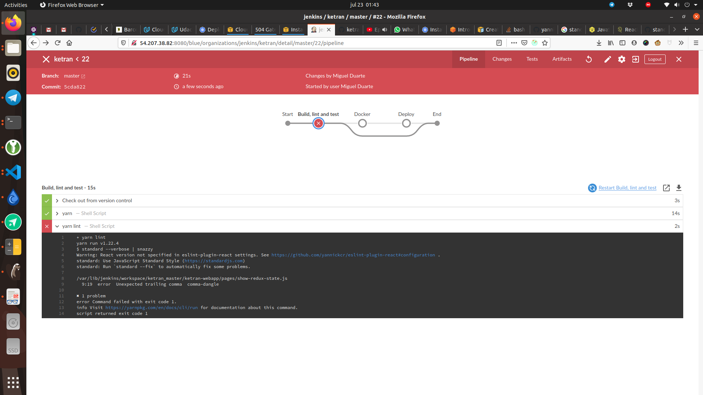

# Udacity devops nanodegree capstone project

## Project description

I decided to use this project as the start for a bigger project that I want
tomake. The project is going to be called "ketran" and it's a piece software
meantto help in logistics and distribution of organic vegetables. 

Still, I didn't implement any business logic, yet. I decided to first
accomplishwhat is needed to fulfill the rubric. For this reason, the app that is
deployedright now is a simple nextjs example with a custom title.

## Repository structure.

There are 2 main folders in the repo:
- ketran-webapp: This folder contains the main webapp. Eventually I'm going to
  add at least a backend, but I started with the front to have something easy to
  show.
- deploy: All the code related to deploy. Inside there 2 folders: 
  - cloudformation: All the templates and scripts to easily run the templates. 
  - kubernetes: a few yaml files describing kubernetes objects to easily deploy
    using kubectl.

## Setting up infrastructure

Spawn the app is not 100% automatic. It requires some manual work to spawn
thefirst time. Also, there is no auto scale of any kind. A detailed instructions
ofhow to set up the infrastructure can be found inside the deploy readme.

### Kubernetes cluster

I decided to manually deploy the kubernetes cluster. I decided to do this
because I foundthat it was the closest thing to what we saw in the course. I
found that the standardway for using eks is by using eksctl, which was different
from the tools used in the course.Installing the cluster by hand was just
deploying servers using cloudformation plus a few scripts. 

The cluster is not 100% high available. It actually has only one master. I
thought that this wasenough for the purpose of this course. But I'm happy to
change that if is needed. 

Given that I used a manual installation of kubernetes, I wasn't able to
useservices of type "loadbalancer". That's why I used "nodeport" and then I
addedan elastic load balancer by hand. 

The deployment in kubernetes is made using a "Deployment" object, wich by
default executesrolling upgrades.

### Cloudformation stacks

I created 3 stacks for this project:
- Network
- Application
- Ci 

Probably application and CI could have been the same. But I thought that I was
going to make changeson the app one more often than in the CI. So, in order to
keep frequently changed files as smallas possible I decided to split CI away.

### Docker registry

I'm using my personal dockerhub account to store docker images.

### Lint

I'm linting the code with standard js. It's a simple js linter that I
reallylike. The linter is ran by
jenkins[here](https://github.com/hojarasca/ketran/blob/master/Jenkinsfile#L12),
andstandard is
called[here](https://github.com/hojarasca/ketran/blob/master/ketran-webapp/package.json#L8).
This is an screen capture of the linter passing in CI: This is an screen capture of the ling
falling in ci:
